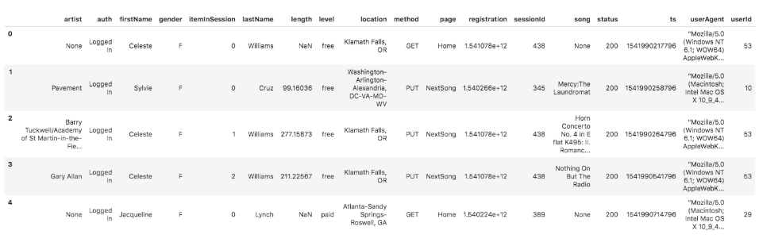
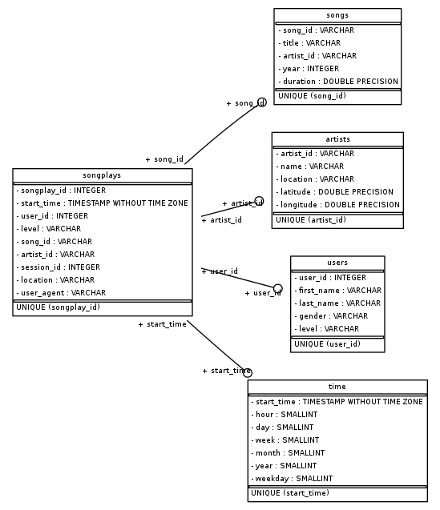

## Project Name
Creation, Data Modeling and Data loading of `sparkify` database (Star schema database in Postgres) for Song Play Analysis.

## Project Description & Purpose
A startup called Sparkify wants to analyze the data they've been collecting on songs and user activity on their new music streaming app. The analytics team is particularly interested in understanding what songs users are listening to. Currently, they don't have an easy way to query their data, which resides in a directory of JSON logs on user activity on the app, as well as a directory with JSON metadata on the songs in their app.

The purpose of this project is to create a Postgres database with Dimension and Fact tables designed to optimize queries on song play analysis, which will help analytics team in understanding what songs users are listening to. Subsequently, the ETL pipeline needs to be built to load the Songs and Song play log data into the created database (`sparkify`) which will be used by the analytics team for further analysis. 

## Source(s)

In this project, the data is extracted from 2 set of files which are of JSON file format. 
* songs data
* log data

#### Song Dataset
The first dataset is a subset of real data from the Million Song Dataset. Each file is in JSON format and contains metadata about a song and the artist of that song. The files are partitioned by the first three letters of each song's track ID. For example, here are filepaths to two files in this dataset.

`song_data/A/B/C/TRABCEI128F424C983.json`
`song_data/A/A/B/TRAABJL12903CDCF1A.json`

And below is an example of what a single song file, TRAABJL12903CDCF1A.json, looks like.

`{"num_songs": 1, "artist_id": "ARJIE2Y1187B994AB7", "artist_latitude": null, "artist_longitude": null, "artist_location": "", "artist_name": "Line Renaud", "song_id": "SOUPIRU12A6D4FA1E1", "title": "Der Kleine Dompfaff", "duration": 152.92036, "year": 0}`
  

#### Log Dataset
The second dataset consists of log files in JSON format which has the Song play activity logs from a music streaming app based on specified configurations.

The log files are partitioned by year and month. For example, here are filepaths to two files in this dataset.

`log_data/2018/11/2018-11-12-events.json`
`log_data/2018/11/2018-11-13-events.json`

And below is an example of what the data in a log file, 2018-11-12-events.json, looks like.

## Target(s)
The data extracted from Source JSON files are loaded into a new Postgres database, named as `sparkify`. Using the song and log datasets, a star schema is created which is optimized for queries on song play analysis. This includes the following tables.

### Schema for Song Play Analysis

#### Fact Table
1. **songplays** - records in log data associated with song plays i.e. records with page NextSong
    * songplay_id, start_time, user_id, level, song_id, artist_id, session_id, location, user_agent
    
#### Dimension Tables
2. **users** - users in the app
    * user_id, first_name, last_name, gender, level
3. **songs** - songs in music database
    * song_id, title, artist_id, year, duration
4. **artists** - artists in music database
    * artist_id, name, location, lattitude, longitude
5. **time** - timestamps of records in songplays broken down into specific units
    * start_time, hour, day, week, month, year, weekday

### Database Schema Diagram
Following is the Schema Diagram for **sparkify** database.

## ETL Process

In computing, extract, transform, load (ETL) is the general procedure of copying data from one or more sources into a destination system which represents the data differently from the source(s). 

1. Data extraction (**Extract**) involves extracting data from homogeneous or heterogeneous sources; 
2. Data transformation (**Transform**) processes data by data cleansing and transforming them into a proper storage format/structure for the purposes of querying and analysis; 
3. Finally, Data loading (**Load**) describes the insertion of data into the final target database such as an operational data store, a data mart, or a data warehouse.

#### ETL - Extract Step
Data is extracted from 2 set of files which are of JSON file format. 
* songs data
* log data

#### ETL - Transform Step
The timestamp for each song play (Start time) is coming in Source files as milliseconds format. This needs to be transformed into proper datetime format before loading into Time dimension. Also, the following time related fields are derived from the timestamp and stored into Time dimension.

* start_time (Timestamp after converting from milliseconds to datetime format)
* hour
* day
* week
* month 
* year
* weekday

#### ETL - Load Step
In the Load step, the extracted and transformed data is loaded into the Dimension and Fact tables in sparkify database. While loading Dimensions, duplicates are eliminated at database level by adding Primary key constraint and Upsert logic while inserting into table.

For example, `song_id` is primary key and unique in `songs` dimension.

Finally songplays fact table is loaded from log data. To establish relationship with dimensions, 

The log file does not specify an ID for either the song or the artist. So in order to relate the corresponding song ID and artist ID for each songplay, a combination of song title, artist name, and song duration time are used. 

The query used for dimension lookup to assign song ID and artist ID is as follows:

##### Dimension Lookup Query:
`select s.song_id, a.artist_id 
    from songs s  
    left join artists a  
    on s.artist_id = a.artist_id
    where s.title = %s 
    and a.name = %s
    and s.duration = %s
` 

##### Target Table count

Table | Remarks |record count
------|--------- |-----------
songs | Total Count | 71
artists | Total Count | 69
users | Total Count | 96
time | Total Count | 6813
songplays | Total Count | 6820
songplays | Matching song and artist found | 1

## Project execution steps
Run the following scripts in the mentioned order.
1. `create_tables.py`

2. `etl.py`

*Since multiple connections to the same database (in this case, sparkifydb) is not possible, please make sure to restart the kernel (or kill the exising active connection) before every new run*

## Environment and Skills
- Python, Ipython
- Postgres, psql

## References
http://www.postgresqltutorial.com/postgresql-cheat-sheet/
https://www.postgresql.org/docs/8.1/ddl-constraints.html
http://www.postgresqltutorial.com/postgresql-upsert/
https://thispointer.com/python-how-to-convert-a-list-to-dictionary/
https://www.markdownguide.org/
https://guides.github.com/features/mastering-markdown/
https://github.com/adam-p/markdown-here/wiki/Markdown-Cheatsheet
https://pandas.pydata.org/pandas-docs/stable/reference/frame.html
http://www.postgresqltutorial.com/postgresql-data-types/
https://en.wikipedia.org/wiki/Extract,_transform,_load